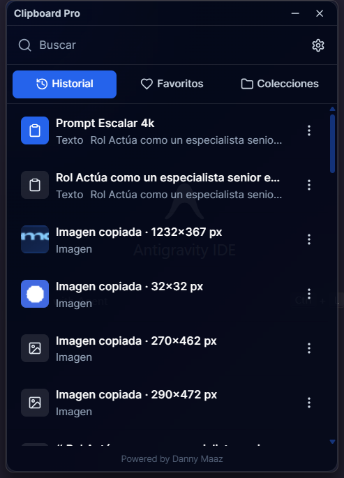
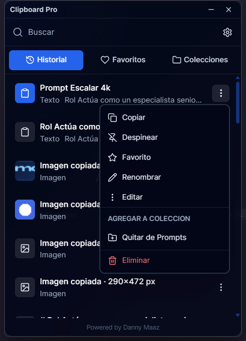
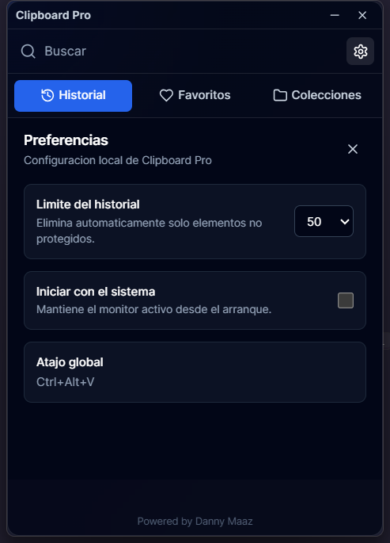
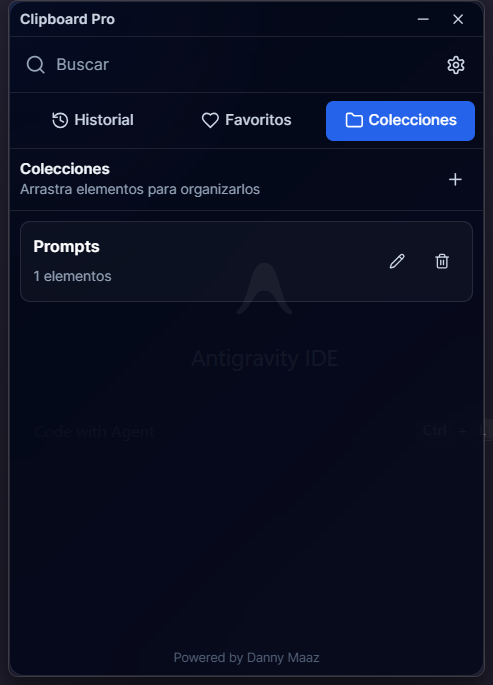

<p align="center">
  
</p>

<h1 align="center">Clipboard Pro</h1>

<p align="center">
  Todo lo bueno del portapapeles nativo, pero con superpoderes.
</p>

<p align="center">
  Created by <strong>Danny Maaz</strong> &middot;
  <a href="https://www.linkedin.com/in/DANNYMAAZ">LinkedIn</a> &middot;
  <a href="https://www.paypal.me/Creativegt">Support the project</a>
</p>

<p align="center">
  <a href="#tecnologias"></a>
  <a href="#tecnologias"></a>
  <a href="#tecnologias"></a>
  <a href="LICENSE"></a>
</p>

Clipboard Pro es una aplicacion de escritorio moderna, minimalista, ultrarrapida y multiplataforma para Windows, macOS y Linux. Mejora el portapapeles nativo con historial, busqueda instantanea, favoritos, pineados, colecciones y edicion de texto, manteniendo una experiencia discreta parecida a `Win + V`, Raycast y Spotlight.

## Caracteristicas

- Historial local con limites configurables de `50`, `100`, `250` y `500` elementos.
- Pineados siempre arriba, sin vista separada y protegidos de eliminacion automatica.
- Favoritos con vista independiente y proteccion permanente.
- Colecciones con creacion, renombrado, eliminacion y relacion muchos-a-muchos.
- Busqueda instantanea con SQLite FTS5 sobre historial, favoritos, pineados y colecciones.
- Deteccion automatica de texto, URL, imagen y documento.
- Imagenes con miniatura real y pegado de imagen desde el historial.
- Renombrado visual y edicion segura solo para texto.
- Atajo global predeterminado `Ctrl + Alt + V`.
- Inicio automatico configurable desde preferencias.
- Privacidad total: sin cloud, sin telemetria, sin analytics y sin servicios externos.

## Capturas

<p align="center">
  
</p>

<p align="center">
  
  
</p>

<p align="center">
  
</p>

## Instalacion

Descarga por sistema:

Windows PowerShell:

```powershell
powershell -ExecutionPolicy Bypass -File scripts/download-windows.ps1 -Repository dannymaaz/clipboard-pro
```

macOS:

```bash
sh scripts/download-macos.sh dannymaaz/clipboard-pro
open clipboard-pro-macos.dmg
```

Linux AppImage:

```bash
sh scripts/download-linux.sh dannymaaz/clipboard-pro appimage
chmod +x clipboard-pro-linux.appimage
./clipboard-pro-linux.appimage
```

Linux Debian/Ubuntu:

```bash
sh scripts/download-linux.sh dannymaaz/clipboard-pro deb
sudo apt install ./clipboard-pro-linux.deb
```

Guia completa en [docs/INSTALLATION.md](docs/INSTALLATION.md).
Matriz por sistema en [docs/PLATFORMS.md](docs/PLATFORMS.md).
Publicacion con GitHub Actions en [docs/GITHUB_RELEASES.md](docs/GITHUB_RELEASES.md).

## Desarrollo

Requisitos:

- Node.js 20+
- Rust estable
- Dependencias de Tauri para Windows, macOS o Linux

```bash
npm install
npm run tauri:dev
```

Build de produccion:

```bash
npm run tauri:build
```

## Uso

- Abre Clipboard Pro con `Ctrl + Alt + V`.
- Copia texto desde cualquier aplicacion; Clipboard Pro lo agregara al historial local.
- Busca con la barra superior.
- Selecciona un elemento para copiarlo, ocultar la ventana y pegarlo en la app activa.
- Usa el menu de tres puntos para copiar, pinear, marcar favorito, agregar a coleccion, renombrar, editar o eliminar.
- Crea colecciones para organizar prompts, URLs, trabajo, universidad, clientes o codigo.
- La app queda en la bandeja del sistema; el inicio automatico se puede activar o desactivar en preferencias.

## Arquitectura

Clipboard Pro usa Clean Architecture ligera:

- `src`: interfaz React, componentes, store Zustand, servicios Tauri y tipos TypeScript.
- `src-tauri/src/domain`: modelos de dominio serializables.
- `src-tauri/src/application`: comandos Tauri expuestos al frontend.
- `src-tauri/src/database`: repositorio SQLite y reglas de persistencia.
- `src-tauri/database/schema.sql`: esquema, indices, FTS5, triggers y settings.
- `docs`: especificacion tecnica, UX, rendimiento, base de datos y roadmap.

Mas detalles en [docs/ARCHITECTURE.md](docs/ARCHITECTURE.md).

## Tecnologias

- React
- TypeScript
- TailwindCSS
- Zustand
- Lucide React
- Tauri v2
- Rust
- SQLite + FTS5

## Roadmap

- MVP: historial, busqueda, copiar, pinear, favoritos, colecciones, renombrar y editar texto.
- Beta: documentos, configuracion visual avanzada y firmas.
- Stable: builds firmados, accesibilidad completa y pruebas E2E.

Consulta [docs/ROADMAP.md](docs/ROADMAP.md).

## Rendimiento

Objetivos del proyecto:

- RAM menor a 50 MB.
- CPU menor al 1% en reposo.
- Inicio menor a 1 segundo.
- Scroll virtualizado.
- Escrituras SQLite eficientes con WAL.
- Sin procesos innecesarios.

Consulta [docs/PERFORMANCE.md](docs/PERFORMANCE.md).

## Contribucion

Las contribuciones son bienvenidas. Lee [CONTRIBUTING.md](CONTRIBUTING.md), [CODE_OF_CONDUCT.md](CODE_OF_CONDUCT.md) y [SECURITY.md](SECURITY.md) antes de abrir issues o pull requests.

## Autor

Clipboard Pro fue creado por Danny Maaz.

- LinkedIn: [DANNYMAAZ](https://www.linkedin.com/in/DANNYMAAZ)
- PayPal: [paypal.me/Creativegt](https://www.paypal.me/Creativegt)

## Licencia

Distribuido bajo licencia MIT. Consulta [LICENSE](LICENSE).
